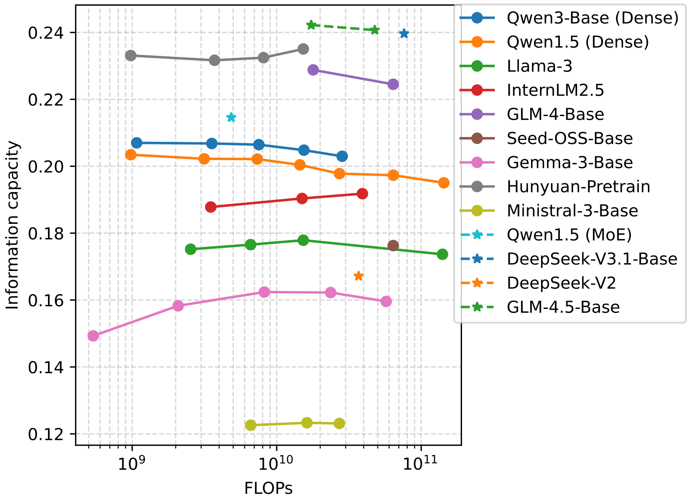

# AI-Flow-Information Capacity

<p align="center">
    
</p>

<p align="center">
        <!-- <a href="README.md">中文</a> &nbsp | &nbsp <a href="README_en.md">English</a> --> 🏆 <a href="https://huggingface.co/spaces/TeleAI-AI-Flow/InformationCapacityLeaderboard"> Leaderboard</a> &nbsp&nbsp | &nbsp&nbsp 
         🖥️ <a href="https://github.com/TeleAI-AI-Flow/InformationCapacity">GitHub</a> &nbsp&nbsp | &nbsp&nbsp 🤗 <a href="https://huggingface.co/datasets/TeleAI-AI-Flow/InformationCapacity">Hugging Face</a>&nbsp&nbsp | &nbsp&nbsp 📑&nbsp <a href="https://www.arxiv.org/abs/2511.08066">Paper</a>
</p>

**Information Capacity** evaluates an LLM's **efficiency** based on text compression performance relative to computational complexity, harnessing the inherent correlation between **compression** and **intelligence**. 
Larger models can predict the next token more accurately, leading to higher compression gains but at increased computational costs. 
Consequently, a series of models with varying sizes exhibits **consistent** information capacity, which can be used to *compare model capability* across model series and *predict model performance* within a series.
It also facilitates *dynamic routing* of different-sized models for *efficient handling* of tasks with varying difficulties, which is especially relevant to the device-edge-cloud infrastructure detailed in the **AI Flow** framework.
With the rapid evolution of edge intelligence, we believe that this hierarchical network will replace the mainstream cloud-centric computing scheme in the near future.

Compared to existing metrics on LLM efficiency, a key difference of information capacity is that it considers the influence of **tokenizer efficiency**.
An effective tokenizer can represent a given text with fewer tokens, thus reducing both the input and output token counts.
This reduction not only lowers computational costs and inference delay but also facilitates *long-context memory* and *in-depth reasoning*.
Tokenizer efficiency exhibits growing significance in light of the exploding input length and the widespread usage of test-time scaling, but is often *neglected* in LLM evaluations.
We assess the information capacity of 49 models across 5 heterogeneous datasets and find consistent evidence regarding the influences of tokenizer efficiency, pretraining data, and the mixture-of-experts (MoE) architecture.

## Method

The model intelligence is measured by the data size savings achieved from the LLM's probability prediction.
The original size of a text sample in the given dataset is denoted as $C$, which is transformed into a sequence of $L$ tokens by the tokenizer of an LLM $M$.
The symbol length of the $i$-th token derived from entropy coding is approximately $-\log p(x_i | x_{<i} ; M)$, and the compression gain is the difference between the original data size and the summed symbol length of all tokens.
The computational complexity is measured by the inference floating-point operations (FLOPs) $N_M$ on a logarithmic scale according to the scaling law.
We introduce a negative bias $b$ in the numerator so that different-sized models in a series have nearly identical information capacities, thus enabling convenient comparison across different model sizes and architectures.

In summary, the computation formula of information capacity is expressed as:
$$ \text{IC} = \frac{b + C - \sum_{i=2}^{L} -\log p(x_i | x_{<i} ; M)}{(L-1) \log (N_M / (L-1))} . $$

## Usage

Step 1. Setup an environment viable for model inference.
```sh
pip install numpy torch transformers tqdm flash_attn
```

Step 2. Clone this repo.
```sh
GIT_LFS_SKIP_SMUDGE=1 git clone https://github.com/TeleAI-AI-Flow/InformationCapacity.git
cd InformationCapacity
```

Step 3. Download test dataset.
```sh
cd ..
git clone https://github.com/TeleAI-AI-Flow/InformationCapacity.git
cd InformationCapacity
```

Step 4. Run evaluation code.
```sh
python calc_ic.py -m path/to/model -d datasets/mixed_text.jsonl -l 1024 -b 1
```

## Citation

```bibtex
@misc{yuan2025informationcapacity,
      title={Information Capacity: Evaluating the Efficiency of Large Language Models via Text Compression}, 
      author={Cheng Yuan and Jiawei Shao and Chi Zhang and Xuelong Li},
      year={2025},
      eprint={2511.08066},
      archivePrefix={arXiv},
      primaryClass={cs.AI},
      url={https://arxiv.org/abs/2511.08066}, 
}

@misc{an2025aiflowperspectivesscenarios,
      title={AI Flow: Perspectives, Scenarios, and Approaches}, 
      author={Hongjun An and Wenhan Hu and Sida Huang and Siqi Huang and Ruanjun Li and Yuanzhi Liang and Jiawei Shao and Yiliang Song and Zihan Wang and Cheng Yuan and Chi Zhang and Hongyuan Zhang and Wenhao Zhuang and Xuelong Li},
      year={2025},
      eprint={2506.12479},
      archivePrefix={arXiv},
      primaryClass={cs.AI},
      url={https://arxiv.org/abs/2506.12479}, 
}

@misc{shao2025aiflownetworkedge,
      title={AI Flow at the Network Edge}, 
      author={Jiawei Shao and Xuelong Li},
      year={2025},
      eprint={2411.12469},
      archivePrefix={arXiv},
      primaryClass={eess.SP},
      url={https://arxiv.org/abs/2411.12469}, 
}
```
